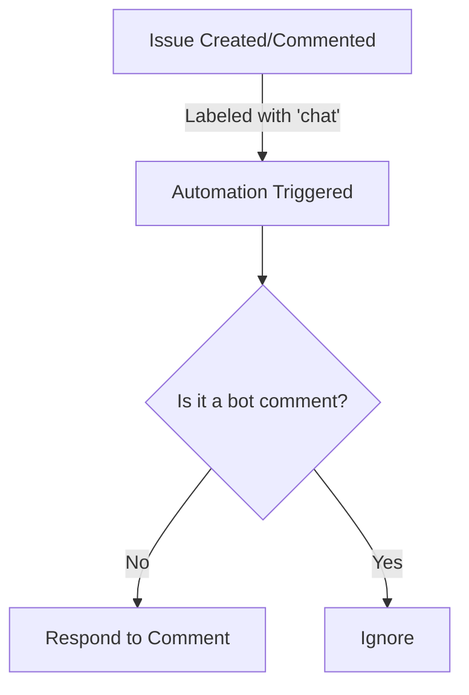

# 🤖 Chat Bot Automation

**ID**: `chat-bot`

This automation enables you to turn any Github issue into a conversation with your AI agent by providing automated responses to comments on issues labeled with `chat`.

## How it Works

- **Trigger Conditions:** The workflow is triggered when an issue is labeled or commented on, and also when a comment is created on an issue.
- **Label Requirement:** The issue must be labeled with `chat` for the automation to respond.
- **Exclusion:** The automation ignores actions initiated by `pr-pilot-ai[bot]` to prevent loops.

## How to Use

1. Ensure the **[Workflow YAML](./workflow.yaml)** file is placed in your `.github/workflows` directory.
2. Label an issue with `chat` or comment on an issue already labeled with `chat`.
3. The automation will respond to comments under the conditions specified above.

## Customization Ideas

- Customize the `agent-instructions` within the workflow to tailor the chat bot's responses based on the issue's content or the nature of the comments.
- Adjust the trigger conditions to include more types of interactions or to narrow down the scope to very specific actions.

This automation provides a basic framework for engaging with users or contributors in a more interactive manner, making the issue handling process feel more personal and dynamic.

