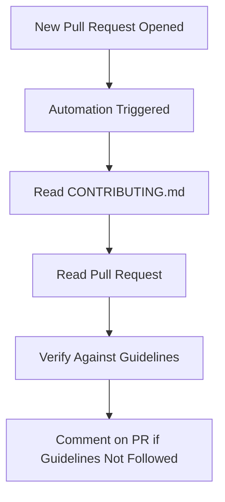

# 📐 Enforce Contribution Guidelines Automation

**ID**: `enforce-contribution-guidelines`

This automation is designed to ensure that all new pull requests adhere to the project's contribution guidelines as outlined in the `CONTRIBUTING.md` file.

## How it Works

- **Trigger Conditions:** The workflow is triggered when a new pull request is opened.
- **Verification Process:** The automation reads the `CONTRIBUTING.md` file to understand the contribution guidelines, then reads the newly opened pull request to determine if it follows these guidelines.
- **Outcome:** If the pull request does not follow the guidelines, the automation will comment on the pull request explaining which parts of the guidelines were not followed.

## How to Use

1. Ensure the **[Workflow YAML](./workflow.yaml)** file is placed in your `.github/workflows` directory.
2. Open a new pull request.
3. The automation will verify the pull request against the contribution guidelines and comment if any discrepancies are found.

## Customization Ideas

- Customize the `agent-instructions` within the workflow to tailor the verification process based on the specific needs of your project or the nature of contributions expected.