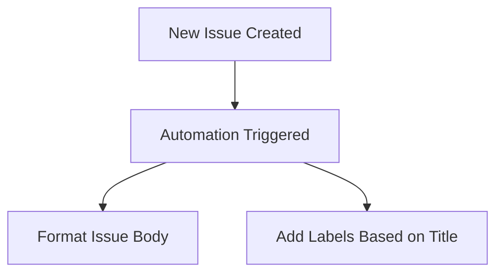

# 📝 Format and Label New Issues

This automation listens for new issues created in your repository and automatically formats the issue body and adds labels based on the issue title.

## How to Use

1. Copy the **[Workflow YAML](./workflow.yaml)** file into your `.github/workflows` directory. 
2. Open a new issue in your repository and see the magic happen!

## Customization Ideas

Use your own words in `formatting-instructions` to describe how you'd like the issue formatted and labeled.

Here are some ideas for what you could say:

* Issue titles must always begin with an Emoji
* Issues labeled with `feature-request` must always contain a checklist of acceptance criteria
* Issues labeled with `bug` must always contain a code snippet that reproduces the bug
* Any file name should be turned into Markdown links to the file in the repository

Your imagination is the limit!
