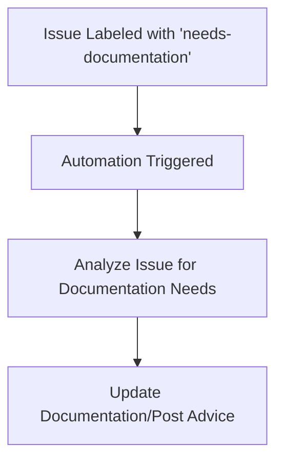

# 📚 Help with Documentation Automation

**ID**: `help-with-documentation`

This automation assists in enhancing project documentation by responding to issues labeled with `needs-documentation`.

## How it Works

- **Trigger Conditions:** The workflow is activated when an issue is labeled with `needs-documentation`.
- **Action:** Upon triggering, the automation analyzes the issue to understand the documentation needs. Depending on the requirements, it may directly update documentation files in the repository or compile documentation advice and post it as a comment on the issue.

## How to Use

1. Ensure the **[Workflow YAML](./workflow.yaml)** file is placed in your `.github/workflows` directory.
2. Label an issue with `needs-documentation`.
3. The automation will assess the issue and take appropriate action to aid in documentation, either by updating files or providing guidance through comments.

## Customization Ideas

- Tailor the `agent-instructions` within the workflow to better suit your project's documentation standards and practices.
- Modify the trigger conditions to include more specific scenarios or additional types of documentation requests.

This automation streamlines the process of improving and updating project documentation, making it easier to maintain high-quality, comprehensive documentation.
