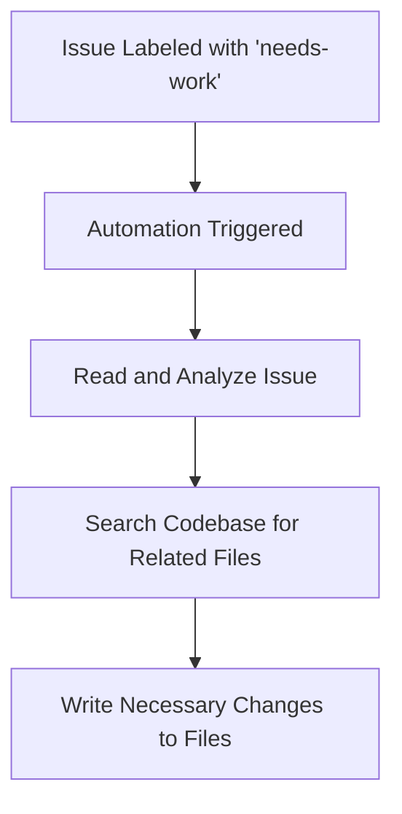

# 🛠 Help with Implementation Automation

**ID**: `help-with-implementation`

This automation is designed to assist with the implementation tasks when an issue is labeled with `needs-work`. It automatically reads the issue, understands the requirements, searches the codebase for related files, and writes the necessary changes to the files.

## How it Works

- **Trigger Conditions:** The workflow is triggered when an issue is labeled with `needs-work`.
- **Implementation Process:** The automation reads the issue, analyzes the description to understand what needs to be worked on, searches the codebase for related files, reads the identified files, and writes the necessary changes to the files.
- **Output:** It commits the changes with a message that includes the issue ID and a brief description of the work done.

## How to Use

1. Ensure the **[Workflow YAML](./workflow.yaml)** file is placed in your `.github/workflows` directory.
2. Label an issue with `needs-work`.
3. The automation will read the issue, understand the requirements, search for related files, and write the necessary changes.

## Customization Ideas

- Customize the `agent-instructions` within the workflow to tailor the implementation process based on the specific needs of your project or the nature of the tasks.
- Adjust the trigger conditions to include more types of interactions or to narrow down the scope to very specific types of tasks.

This automation provides a structured approach to handling implementation tasks, helping to streamline the process and ensure that necessary changes are made efficiently.