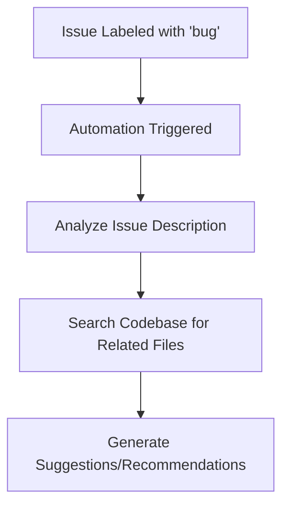

# 🐞 Investigate Bug Automation

This automation is designed to assist in the initial investigation of issues labeled with `bug` by automatically analyzing the issue description and searching the codebase for related files. It then generates a list of suggestions or recommendations to address the bug.

## How it Works

- **Trigger Conditions:** The workflow is triggered when an issue is labeled with `bug`.
- **Analysis Process:** The automation reads the issue, analyzes the description for keywords related to the bug, searches the codebase for related files using these keywords, and then reads the identified files.
- **Output:** It generates a list of suggestions or recommendations based on the analysis and comments on the issue with this information.

## How to Use

1. Ensure the **[Workflow YAML](./workflow.yaml)** file is placed in your `.github/workflows` directory.
2. Label an issue with `bug`.
3. The automation will perform an initial investigation and comment on the issue with suggestions or recommendations.

## Customization Ideas

- Customize the `agent-instructions` within the workflow to tailor the investigation process based on the specific needs of your project or the nature of the bugs encountered.
- Adjust the trigger conditions to include more types of interactions or to narrow down the scope to very specific types of bugs.

This automation provides a structured approach to bug investigation, helping to streamline the initial analysis and suggesting potential fixes or areas for further investigation.
