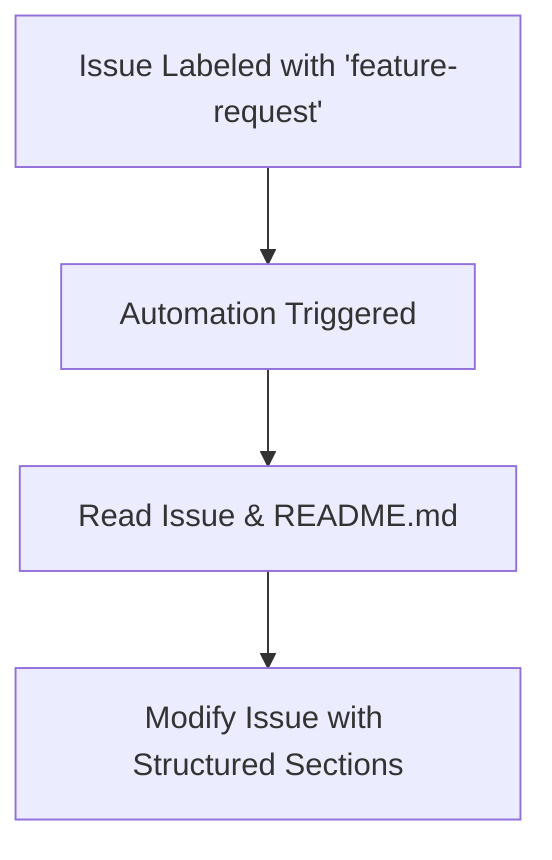

# 👩‍💼 Product Owner Automation

**ID**: `product-owner`

This automation acts as a virtual Product Owner for your project. It is triggered when an issue is labeled with `feature-request`. The automation reads the issue, understands the project by reading the `README.md`, and then modifies the issue to include sections for user story, functional and non-functional requirements, and out of scope.

## How it Works

- **Trigger Conditions:** The workflow is triggered when an issue is labeled with `feature-request`.
- **Modification Process:** The automation reads the issue and the project's `README.md` file. It then modifies the issue to include structured sections for a user story, functional and non-functional requirements, and what is out of scope.

## How to Use

1. Ensure the **[Workflow YAML](./workflow.yaml)** file is placed in your `.github/workflows` directory.
2. Label an issue with `feature-request`.
3. The automation will modify the issue to include sections for user story, functional and non-functional requirements, and out of scope.

## Customization Ideas

- Customize the `agent-instructions` within the workflow to tailor the modification process based on the specific needs of your project or the nature of the feature requests encountered.