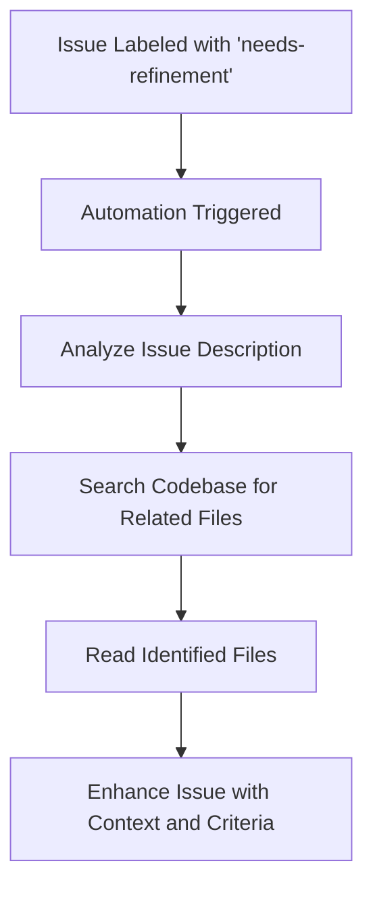

# 🔍 Refine Issue Automation

**ID**: `refine-issue`

This automation is designed to refine issues that are labeled with `needs-refinement` by automatically analyzing the issue description, searching the codebase for related files, and then enhancing the issue with relevant context and acceptance criteria.

## How it Works

- **Trigger Conditions:** The workflow is triggered when an issue is labeled with `needs-refinement`.
- **Refinement Process:** The automation reads the issue, analyzes the description for keywords, searches the codebase for related files using these keywords, reads the identified files, and then edits the issue to add relevant context and acceptance criteria.

## How to Use

1. Ensure the **[Workflow YAML](./workflow.yaml)** file is placed in your `.github/workflows` directory.
2. Label an issue with `needs-refinement`.
3. The automation will refine the issue by adding relevant context and acceptance criteria.

## Customization Ideas

- Customize the `agent-instructions` within the workflow to tailor the refinement process based on the specific needs of your project.
- Adjust the trigger conditions to include more types of interactions or to narrow down the scope to very specific types of issues.

This automation provides a structured approach to issue refinement, helping to clarify the issue's scope and requirements before further action is taken.
