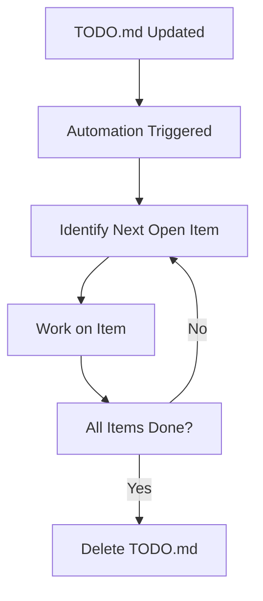

# 📋 Work on TODO List Automation

**ID**: `work-on-todo-list`

This automation is designed to automatically work on items listed in the `TODO.md` file on the main branch. When `TODO.md` is updated, the automation identifies the next open item on the list and fulfills it to the best of its abilities. If all items are completed, it deletes the `TODO.md` file.

## How it Works

- **Trigger Conditions:** The workflow is triggered when `TODO.md` on the main branch is changed.
- **Action Process:** The automation reads `TODO.md`, identifies the next open item, and works on fulfilling that task. If all tasks are completed, `TODO.md` is deleted.

## How to Use

1. Ensure the **[Workflow YAML](./workflow.yaml)** file is placed in your `.github/workflows` directory.
2. Update `TODO.md` on the main branch as needed.
3. The automation will automatically work on the next open item in the TODO list or delete the file if all items are completed.

## Customization Ideas

- Customize the `agent-instructions` within the workflow to tailor the task fulfillment process based on the specific needs of your project or the nature of the tasks listed in `TODO.md`.
